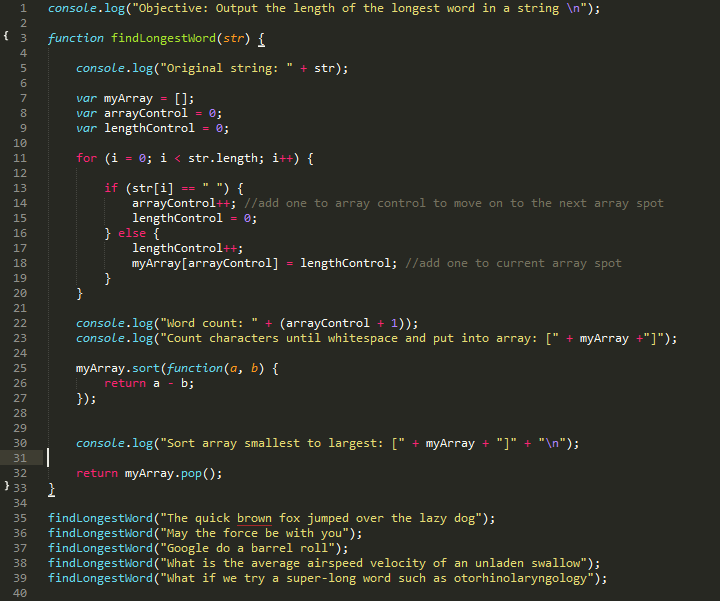
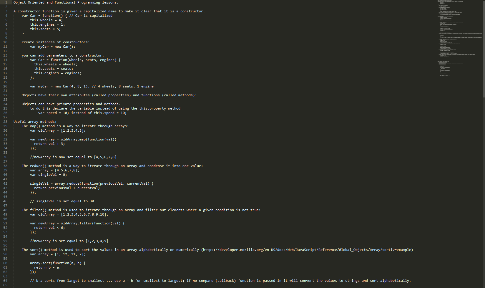
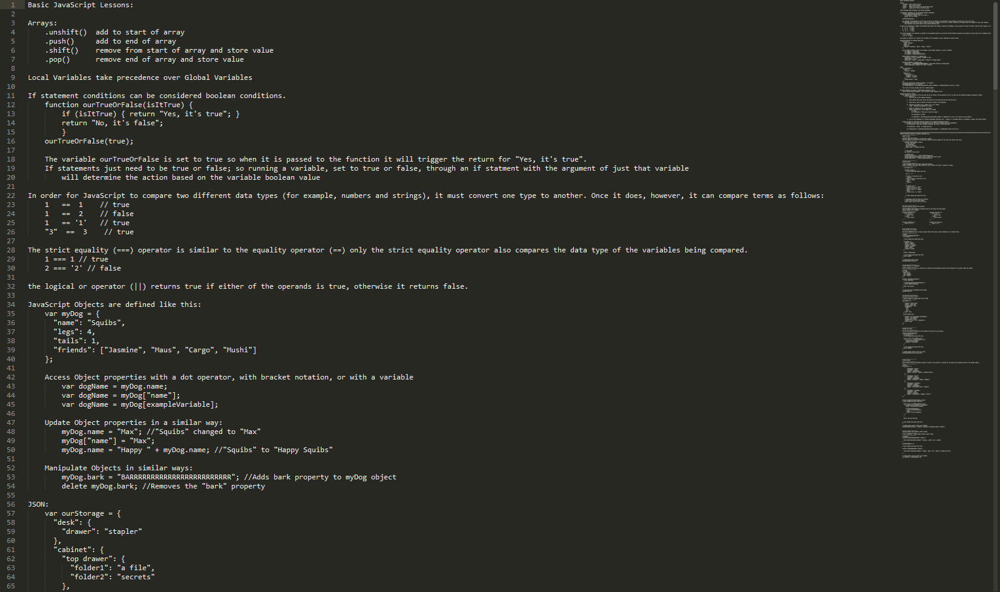
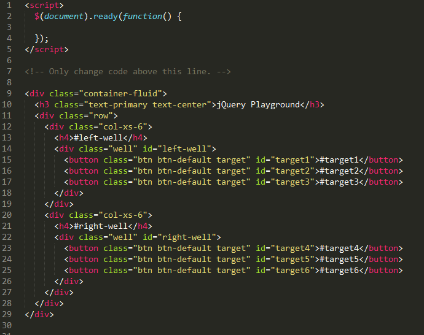
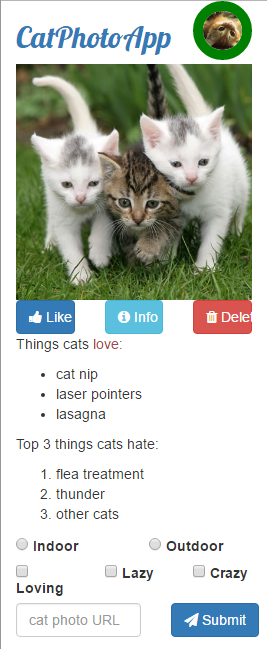

# [freeCodeCamp](https://github.com/Squibs/freeCodeCamp#freecodecamp)
## Front End Development Certification

### [My Front End Development Certificaton](https://github.com/Squibs/freeCodeCamp/tree/master/Front%20End%20Development%20Certification/my-front-end-development-certification)

---

### [Simon Game](https://github.com/Squibs/simon-game)

---

### [Tic-Tac-Toe](https://github.com/Squibs/tic-tac-toe)

---

### [Pomodoro Clock](https://github.com/Squibs/pomodoro-clock)

---

### [JavaScript Calculator](https://github.com/Squibs/js-calculator)

---

### [Advanced Algorithms](https://github.com/Squibs/freeCodeCamp/tree/master/Front%20End%20Development%20Certification/advanced-algorithm-scripting)

---

### [Intermediate Algorithms](https://github.com/Squibs/freeCodeCamp/tree/master/Front%20End%20Development%20Certification/intermediate-algorithm-scripting)

---

### [Twitch Streamer Status](https://github.com/Squibs/twitch-streamers)

---

### [Wikipedia Viewer](https://github.com/Squibs/wikipedia-viewer)

---

### [Local Weather](https://github.com/Squibs/local-weather)

---

### [Quote Machine](https://github.com/Squibs/quote-machine/tree/before-react)

---

### [JSON APIs and Ajax](https://github.com/Squibs/freeCodeCamp/tree/master/Front%20End%20Development%20Certification/json-apis-and-ajax)

---

### [Basic Algorithms](https://github.com/Squibs/freeCodeCamp/tree/master/Front%20End%20Development%20Certification/basic-algorithm-scripting)

---

### [Object Oriented and Functional Programming](https://github.com/Squibs/freeCodeCamp/tree/master/Front%20End%20Development%20Certification/object-oriented-and-functional-programming)

---

### [Basic JavaScript](https://github.com/Squibs/freeCodeCamp/tree/master/Front%20End%20Development%20Certification/basic-javascript)

---

### [Portfolio](https://github.com/Squibs/Squibs.github.io)

---

### [Tribute Page](https://github.com/Squibs/freeCodeCamp/tree/master/Front%20End%20Development%20Certification/tribute-page)

---

### [jQuery Playground](https://github.com/Squibs/freeCodeCamp/tree/master/Front%20End%20Development%20Certification/jquery-playground)

---

### [Cat Photo App](https://github.com/Squibs/freeCodeCamp/tree/master/Front%20End%20Development%20Certification/cat-photo-app) (Responsive Design with Bootstrap)
