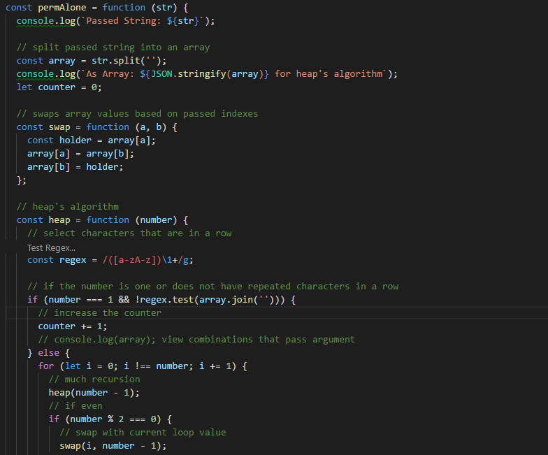

# [freeCodeCamp](https://github.com/Squibs/freeCodeCamp#freecodecamp)

## [Front End Development Projects](https://github.com/Squibs/freeCodeCamp/tree/master/Front%20End%20Development%20Certification#intermediate-algorithms) (Go Back)



### Advanced Algorithms

<em>Completed July 6, 2017</em>

This was the last series of algorithm challenges for the Front End Development Certificaton. It was quite something going through all the beginner, intermediate and now advanced challenges. I learned quite a lot, and I know I still have much to learn yet. I will be moving onto the beta freeCodeCamp website completely, once I finish the rest of the Front End Development Certificaton.


---

#### My notes for these algorithms:

<b>Advanced Algorithms</b>

1. [General Notes](#general-notes)
2. [Validate US Telephone Numbers](#validate-us-telephone-numbers)
3. [Record Collection](#record-collection)
4. [Symmetric Difference](#symmetric-difference)
5. [Exact Change](#exact-change)
6. [Inventory Update](#inventory-update)
7. [No Repeats Please](#no-repeats-please)
8. [Make a Person](#make-a-person)
9. [Map the Debris](#map-the-debris)
10. [Pairwise](#pairwise)


##### General Notes
I created these solutions based on my current level of knowledge. Any of these solutions can most definitely be improved, I am by no means an expert at this at all. I believe I have come up with some decent alternative solutions for these advanced algorithm challenges.

---

##### Validate US Telephone Numbers

```JavaScript
// CONDENSED VERSION - NO CONSOLE OUTPUTS
const telephoneCheck = function (str) {
  return /^1*\s?(\s?\(\d{3}\)\s?|\d{3}-?\s?)\d{3}\s?-?\d{4}$/g.test(str);
};
```

(validate-telephone.js)

This challenge was all bout using `regular expressions`. Two sources made this possible to figure out on my own:
- [A Regular Expressions reference](https://developer.mozilla.org/en-US/docs/Web/JavaScript/Guide/Regular_Expressions)
- [regex101](https://regex101.com/)

Using these I was able to work my way through finding a correct match for the required, passed phone numbers/strings.

1. `^1*` Selects zero or more occurrences of (number/digit/integer) `1` at the start of a string.
2. `\s?` Indicates a possible whitespace after the zero or more selected `1`
3. `(\s?\(\d{3}\)\s?|\d{3}-?\s?)`
	1. `(\s?` The `(` groups together two expressions, `(\s?` Indicates a possible whitespace before
	2. `\(` Selects an open parenthesis
	3. `\d{3}` Selects a set of three digits
	4. `\)` Selects a close parenthesis
	5. `\s?` Indicates a possible whitespace after
	6. `|` Indicates an alternative expression; why there was a beginning parenthesis
	7. `\d{3}` Selects a set of three digits
	8. `-?` Indicates a possible hyphen
	9. `\s?)` Indicates a possible whitespace, `)` closes the grouped expressions
4. `\d{3}` Selects a set of three digits
5. `\s?` Indicates a possible whitespace
6. `-?` Indicates a possible hyphen
7. `\d{4}$` Selects a set of four digits, that is at the end of a string

Together this selects a possible area code that can only be 1, two sets of 3 digits, and a set of 4 digits. The first set of 3 digits can have parentheses around it or not, and both must be present. There can be spaces or hyphens between each group of digits (including the area code), but if the first set of 3 digits has parentheses it cannot have a hyphen after it.

The basic cod solution provided is pretty similar to mine:
```JavaScript
function telephoneCheck(str) {
   var regex = /^(1\s?)?(\(\d{3}\)|\d{3})[\s\-]?\d{3}[\s\-]?\d{4}$/;
   return regex.test(str);
}
```

While the Intermediate Code Solution, Checks for a lot more things using regular expressions:
```JavaScript
function telephoneCheck(str) {
  var re = /^(?:(?:\+?1\s*(?:[.-]\s*)?)?(?:\(\s*([2-9]1[02-9]|[2-9][02-8]1|[2-9][02-8][02-9])\s*\)|([2-9]1[02-9]|[2-9][02-8]1|[2-9][02-8][02-9]))\s*(?:[.-]\s*)?)?([2-9]1[02-9]|[2-9][02-9]1|[2-9][02-9]{2})\s*(?:[.-]\s*)?([0-9]{4})$/;
  return re.test(str);
}
telephoneCheck("555-555-5555");
```

freeCodeCamp states that this example, the intermediate code solution, is an example of a very comprehensive and robust solution. And that in such cases it might be much better and easier to implement this library [libphonenumber](https://github.com/googlei18n/libphonenumber).

In the end I feel I completed this challenge in a way quite similar to the way freeCodeCamp would be expecting someone to finish this challenge at this stage of progress through the Front End Development Certification.

In the future I would probably split the regular expression up into different variables and them combine them later to keep things neater and give more explaination of what is happening; and to make changes to the expression easier. This could also mean in longer strands of regex, previously variables could be used again instead of rewriting what may be already written if everything is formatted in a logical way.

---

##### Record Collection

```JavaScript
// CONDENSED VERSION - NO CONSOLE OUTPUTS
const updateRecords = function (id, prop, value) {
if (!collection[id][prop]) {
	if (prop === 'tracks') {
	collection[id][prop] = [];
	} else {
	collection[id][prop] = value;
	}
}
if (value === '') {
	delete collection[id][prop];
} else if (Array.isArray(collection[id][prop])) {
	collection[id][prop].push(value);
} else {
	collection[id][prop] = value;
}
return collection;
};
```

(record-collection.js)

This challenge felt out of place. The entire time I was thinking there is probably going to be a better way to handle this; however, going to the provided solutions for this problem after completing my solution, I was left slightly confused. The provided solution, only a basic solution is available for this challenge, is much like mine. A lot of if statements, and nested if statements:

```JavaScript
function updateRecords(id, prop, value) {
  if (prop === "tracks" && value !== "") {
   if(collection[id][prop]) {
    collection[id][prop].push(value);
   }
   else {
    collection[id][prop]=[value];
   }
  } else if (value !== "") {
    collection[id][prop] = value;
  } else {
    delete collection[id][prop];
  }

  return collection;
}
```

This challenge didn't take very long at all to complete and I almost feel like it should not be in the advanced algorithm challenges. I know freeCodeCamp has a beta site up for a future restructure, and I have gone through some of it before returning back to the released version of freeCodeCamp; hopefully this is something that they will be fixing (or perhaps it already is fixed). Nonetheless I do now know how to work with objects just a little more.

I now know how to add a property and how to delete a property. Adding a property is simply just setting a wanted property to a value with an `=` operator. And deleting a property is as simple as using the `delete` operator and listing the `object.property` or `object[varForProp]`.

---

##### Symmetric Difference

```JavaScript
// CONDENSED VERSION - NO CONSOLE OUTPUTS
const sym = function (...argument) {
  let args = argument.map(value => value.sort().join(''));

  return args.reduce((prev, cur) => {
    const symmilar = [];
    for (let i = 0; i < cur.length; i += 1) {
      if (!prev.includes(cur.charAt(i)) && !symmilar.join('').includes(cur.charAt(i))) {
        symmilar.push(cur.charAt(i));
      }
    }
    for (let i = 0; i < prev.length; i += 1) {
      if (!cur.includes(prev.charAt(i)) && !symmilar.join('').includes(prev.charAt(i))) {
        symmilar.push(prev.charAt(i));
      }
    }
    return symmilar.sort().join('');
  }).split('').map(value => parseInt(value, 10));
};
```

(symmetric-difference.js)

I had to redo this challenge several times. It definitely helps to understand what you are trying to accomplish before jumping in and finding an incorrect solution. Initially I grouped every argument into a single array, flattened the array, sorted the array, and the removed all duplicate values `(1, 1, 2, 2, 3, 4, 5, 5) => (3, 4)`; as this is what I believed this challenge was asking for. This was not the case, as I soon found out after trying to submit my answer. I then went back and modified my original answer several times, before finally giving into the fact that I had no idea what the challenge was asking for.

I ended up going through each case and breaking down what was happening step by step, until I figured out the answer. Below is an example of what I did to understand what was happening for this challenge:

```
[3, 3, 3, 2, 5], [2, 1, 5, 7], [3, 4, 6, 6], [1, 2, 3] should return [2, 3, 4, 6, 7]
[3, 3, 3, 2, 5]     △     [2, 1, 5, 7]     =     [1, 3, 7]
          •  •             •     •
      [1, 3, 7]     △     [3, 4, 6, 6]     =     [1, 4, 6, 7]
          •                •
   [1, 4, 6, 7]     △     [1, 2, 3]        =     [2, 3, 4, 6, 7]
    •                      •
```

After going through the first few of cases for this challenge in the same manner as the above, I understood what was happening to get the desired results. Having examples written out like the above for each case was also useful for debugging my code.

Looking at the provided solutions, I feel as though I provided an adequate solution for this algorithm challenge. Of course as usual my solution could definitely be improved, but it does do what this challenge is asking for.

---

##### Exact Change

```JavaScript
// CONDENSED VERSION - NO CONSOLE OUTPUTS
const checkCashRegister = function (price, cash, cid) {
  const change = [];
  let owe = Number(cash - price).toFixed(2);
  let worth = ['ONE HUNDRED', 'TWENTY', 'TEN', 'FIVE', 'ONE', 'QUARTER', 'DIME', 'NICKEL', 'PENNY'];
  const cashRegister = {
    PENNY: {
      value: 0.01,
      amount: 0,
    },
    NICKEL: {
      value: 0.05,
      amount: 0,
    },
    DIME: {
      value: 0.10,
      amount: 0,
    },
    QUARTER: {
      value: 0.25,
      amount: 0,
    },
    ONE: {
      value: 1.00,
      amount: 0,
    },
    FIVE: {
      value: 5.00,
      amount: 0,
    },
    TEN: {
      value: 10.00,
      amount: 0,
    },
    TWENTY: {
      value: 20.00,
      amount: 0,
    },
    'ONE HUNDRED': {
      value: 100.00,
      amount: 0,
    },
  };

  cid.forEach((e) => {
    const currency = cashRegister[e[0]];
    currency.amount = Math.ceil(e[1] / currency.value);
  });

  worth = worth.filter((e) => {
    const currency = cashRegister[e];
    if (currency.value < owe && currency.amount !== 0) {
      let amount = 0;
      while (currency.value <= owe && currency.amount !== 0) {
        amount += 1;
        currency.amount -= 1;
        owe = Number(owe).toFixed(2) - Number(currency.value).toFixed(2);
      }
      change.push([e, parseFloat(Number(amount * currency.value).toFixed(2))]);
    }
    if (currency.amount === 0) { return false; }
    return true;
  });

  if (owe === 0 && worth.length === 0) { return 'Closed'; }
  if (owe > 0) { return 'Insufficient Funds'; }

  return change;
};
```

(exact-change.js)

For this challenge I wanted to work with an object, because there have not been too many challenges where they were used; and every challenge has been using arrays and their methods.

The passed cash register <em>inventory</em> or the amount of demonimations the cash register has, was in a two dimensional array. Converting this array to values in my `cashRegister` object is where I learned about some <em>experimental features</em> dealing with objects in JavaScript. I learned about `Object.entries()` and `Object.values()`. These two methods allow for iterating through objects without having to use a for loop such as `for (var key in obj)` or `for (const key of Object.keys(obj))`. Instead you would be able to do:
```JavaScript
Object.entries(obj).forEach(([key, value]) => {
  console.log('do things other than a console log')
});
```

Or use `Object.values` similarly; or even combine the two in some way.

I avoided using these for now. Instead I opted for using what I already knew in conjunction with my `cashRegister` object. My object stores each denomination/currency, their value, and the amount of each denomination passed to the function.

After storing any denomination related information, I use the `filter()` method to go through a `worth` array I created which is holding the denomination names in order from highest value to lowest value. I had to create this array, because I opted to not use experimental object methods. Iterating through this array I check if the currency value is equel to or less than that of what is owed and if the currency amount is not 0. 

If the checks pass I have a while loop that counts the amount of a currency that will be given to the customer, subtracts one of the currency from the cash register and updates the amount still owed to the customer. This loop is controlled by if the currency value is less than or equal to the amount owed and if the currency amount is not 0.

Once that loop finishes the change type and amount is pushed to the change variable in an array. And finally if the currency amount is equal to 0, return false to remove it from the worth array. Otherwise return true to leave it in the array.

Finally I have two final checks after that ordeal. If the amount still owed to the customer is equal to 0 and the worth array length is 0, meaning there is nothing left in the register, return 'closed'. If the amount owed is greater than 0 return 'insufficient funds'. Finally, after all that return the change array.

Explanation over.

While my solution does work for these cases there are some specific cases, where this would not work. I learned this out once I finished and was looking for the bonfire / provided solution for this challenge. I came across [this post](https://medium.freecodecamp.org/exact-solution-for-exact-change-81e1d23bfe58) which pretty much states what is wrong with my answer.

In a case where 30 cents in change is needed and the cash register has 10 dimes and 10 quarters, my solution will return insufficient funds instead of 3 dimes due to the way I created it. Going from the largest denomination to the smallest causes this issue.

I would solve this issue in my final check of the amount owed (`owe > 0`). In this check before I return 'insufficient funds' I would loop back through my worth array backwards and check for the correct change in a similar way as before. If that then fails, then I would finally return 'insufficient funds'. However, I'm not sure if there would be more cases in doing this, where the same problem could show up.

In the end, I'm glad I decided to use an object in this algorithm challenge instead of just arrays. I got to learn just a bit more about working with objects.

---

##### Inventory Update

```JavaScript
// CONDENSED VERSION - NO CONSOLE OUTPUTS
const updateInventory = function (arr1, arr2) {
  let combined = [];
  let curInv = arr1.concat(arr2).sort((a, b) => {
    if (a[1] === b[1]) {
      return 0;
    }
    return a[1] < b[1] ? -1 : 1;
  }).reduce((prev, cur) => {
    const change = combined;
    let flag = true;
    if (combined.length === 0) {
      combined.push(prev);
    }
    combined.forEach((value, index) => {
      if (value[1] === cur[1]) {
        combined[index][0] += cur[0];
        flag = false;
      }
    });
    if (flag) {
      combined.push(cur);
      flag = true;
    }
    return combined;
  });

  return curInv;
};
```

(inventory-update.js)

For this challenge, I combined the two passed arrays into one with the `concat()` method. I then sorted the combined two dimensional array with the `sort()` method and from there I did the rest with the `reduce()` method.

I needed two things for of the `reduce()` method to get this to work. I needed an outside variable `combined` and a `flag` to control what was being pushed to `combined`. If the length of combined is 0 I would push the previous array into it, this would only run on the first iteration of the `reduce()` method. I then used the `forEach()` method on combined and tested if the current value of the `forEach()` method is equal to the current value of the `reduce()` method and if it is combine the total in the previous and current arrays and set the flag to false. Finally if the flag is true push the current value (to control repeats).

Looking at the provided solutions it is easy to see where I could have improved. Instead of using the `reduce()` method, I could have used nested `forEach()` methods. I had the right idea in using a flag to control whether or not to push the current value or not, I just was not sure how to go about comparing the values. I think my major issue / flaw / querk for this challenge was combining the two arrays right off the bat and trying to work with the combined array. It would have been much simpler to work with the two separate passed arrays.

---

##### No Repeats Please

```JavaScript
// CONDENSED VERSION - NO CONSOLE OUTPUTS
const permAlone = function (str) {
  const array = str.split('');
  let counter = 0;

  const swap = function (a, b) {
    const holder = array[a];
    array[a] = array[b];
    array[b] = holder;
  };

  const heap = function (number) {
    const regex = /([a-zA-z])\1+/g;

    if (number === 1 && !regex.test(array.join(''))) {
      counter += 1;
    } else {
      for (let i = 0; i !== number; i += 1) {
        heap(number - 1);
        if (number % 2 === 0) {
          swap(i, number - 1);
        } else {
          swap(0, number - 1);
        }
      }
    }
  };
  heap(array.length);
  return counter;
};
```

(no-repeats-please.js)

This one was very difficult. I repeatedly tried to solve this with what I already know, and failed many times. Many of my attempts included this:

```JavaScript
const factorial = function (number) {
  if (number === 1) { return 1; }
  return number * factorial(number - 1);
};
```

I thought this would bring me success in solving this challenge on my own. It is just a simple method to get the factorial of a number. I tried many times to figure out how to get to the correct outcome for each case for this challenge, but I just could not figure it out on my own. I then tried using [this guide](https://stackoverflow.com/questions/32282607/permutations-excluding-repeated-characters/36178855#36178855) in order to create my solution. Ultimately I think my major problem with this algorithm challenge is not understanding how exactly to calculate the answers outside of programming; having basic fundamental knowledge in how to solve this with pen and paper. No matter what I did I could not understand how to get the answer for `permAlone("aaabb") should return 12`. Sure I can easily write out the combinations or visualize them, but I do not know the correct formula to calculate the answer.

In the end I had to resort to using [Heap's Algorithm](https://en.wikipedia.org/wiki/Heap%27s_algorithm) in order to solve this challenge:

```JavaScript
procedure generate(n : integer, A : array of any):
    if n = 1 then
          output(A)
    else
        for i := 0; i < n - 1; i += 1 do
            generate(n - 1, A)
            if n is even then
                swap(A[i], A[n-1])
            else
                swap(A[0], A[n-1])
            end if
        end for
        generate(n - 1, A)
    end if
```

Even having this pseudocode, I struggled to find a way to use this in order to solve this problem. I tried many different ways to use this algorithm in-conjunction with the passed string, but couldn't find an appropriate way to get the answer I desired. Many times I created infinite loops in my translated version of `Heap's Algorithm` or simply created stack overflow errors. Getting to the solution without additional help was just not going to happen.

I ended up watching many videos on using `Heap's Algorithm` and ended up borrowing ideas from different sources until I managed to solve this challenge. I do not feel all that successful at the end of this challenge; however this was a great learning experience. `Heap's Algorithm` is a great example of recursion with [multiple branches](https://discourse-user-assets.s3.amazonaws.com/optimized/2X/7/76fac6502eaadd8e1c63b223163ddcceef6cd3cf_1_690x387.png).

Looking for the provided solution to this challenge, it looks like a great deal of people struggled to solve this one as well; that makes me feel a bit better about how I went about solving it. In the end I believe that using either of `Heap's Algorithms` (recursive or non-recursive) is probably one of the more optimal ways to solve this challenge.

---

##### Make a Person

```JavaScript
// CONDENSED VERSION - NO CONSOLE OUTPUTS
const Person = function (firstAndLast) {
  let fullName = firstAndLast;

  this.getFirstName = function () {
    return fullName.split(' ')[0];
  };

  this.getLastName = function () {
    return fullName.split(' ')[1];
  };

  this.getFullName = function () {
    return fullName;
  };

  this.setFirstName = function (first) {
    fullName = `${first} ${fullName.split(' ')[1]}`;
  };

  this.setLastName = function (last) {
    fullName = `${fullName.split(' ')[0]} ${last}`;
  };

  this.setFullName = function (firstAndLast) {
    fullName = firstAndLast;
  };
};

const bob = new Person('Bob Ross');
bob.getFullName();
```

(make-a-person.js)

I enjoyed this one. While it is not hard, it was about how I learned how to program in the first place. While this is not using getters and setters, which it honestly should probably be doing; this challenge showed me how JavaScript handled setting and getting before getters and setters were introduced.

I do not feel like there is much to say about this challenge. Comparing my answer to the provided one; there is little different. Only real difference is I'm using string concatenations to set fullName, while the provided solution uses the `+` operator.

I recreated this in ES6 syntax, to see how it would work. Everything works the exact same, the way you create the Person class is a little different however:

```JavaScript
class Person {
  constructor(firstAndLast) {
    this.fullName = firstAndLast;
  }

  getFirstName() {
    return this.fullName.split(' ')[0];
  }

  getLastName() {
    return this.fullName.split(' ')[1];
  }

  getFullName() {
    return this.fullName;
  }

  setFirstName(first) {
    this.fullName = `${first} ${this.fullName.split(' ')[1]}`;
  }

  setLastName(last) {
    this.fullName = `${this.fullName.split(' ')[0]} ${last}`;
  }

  setFullName(firstAndLast) {
    this.fullName = firstAndLast;
  }
}
```

After testing this revised part some more it seems that there is no real way to set private variables with this quite yet, or I just can't seem to find a real answer to do it. There really is not a whole lot of examples or information in general on using the ES6 way of classes. I tried fiddling with getters and setters in this as well, but it really didn't seem to make that much of a difference. `bob.fullName` was always accessible in my recreation when it should not be.

---

##### Map the Debris

```JavaScript
// CONDENSED VERSION - NO CONSOLE OUTPUTS
const orbitalPeriod = function (arr) {
  const GM = 398600.4418;
  const earthRadius = 6367.4447;
  const array = [];

  arr.forEach((value) => {
    array.push({ name: value.name, orbitalPeriod: Math.round(2 * Math.PI * Math.sqrt(Math.pow(earthRadius + value.avgAlt, 3) / GM)) });
  });

  return array;
};
```

(map-the-debris.js)

This one truly was not much of a challenge. The hardest part was finding the correct formula in order to calculate the desired results. I ended up finding [this equation](https://en.wikipedia.org/wiki/Orbital_period#Small_body_orbiting_a_central_body) for a small body orbiting a central body. I then converted the equation to make sense for the already provided function variables:

```
2π * square √((avgAlt + earthRadius)³ / GM)
```

I then went and solved the challenge pretty easily. It just requries a lot of `Math` object calls in order to calcuate the correct result. You then push an object with the correct values into an array and return that array.

Looking at the provided answer, they give a hint as to the formula to use. That would have been nice to have a bit earlier; however, it didn't very long to find and convert for myself.

---

##### Pairwise

```JavaScript
// CONDENSED VERSION - NO CONSOLE OUTPUTS
const pairwise = function (arr, arg) {
  const array = arr;
  let sum = 0;

  array.forEach((value, index) => {
    for (let i = 0; i < array.length; i += 1) {
      if (value + array[i] === arg && index !== i) {
        sum += index + i;
        array[i] = 'banana'; // could use delete, but i'd rather make it a banana
        array[index] = 'banana';
        break;
      }
    }
  });

  return sum;
};
```

(pairwise.js)

This challenge wasn't all that hard either. Once again as long as I understand what is happening I think finding a solution is quite simple. For this challenge I stored the passed array in new variable `array`, as I would be changing values of the passed array and due to AirBnB / eslint standards you should not really be assigning values to passed arguments / variables. I then create a sum variable to hold the desired outcome for this challenge.

I iterate through the passed array with the `forEach()` method and create a for loop to through the same array again (I can probably do this in a better way rather than using a for loop). If the current value in the `forEach()` method is equal to the current value in the for loop and the indices are not the same, I would push the sum of their indices to the `sum` variable and set each element equal to 'banana'. I could also just use delete to remove the element, but I wanted to add a touch of yellow to my modified array. I then break out of the loop, otherwise it would continue to compare values with the value that was now removed (it would keep the value, as I'm not directly modifying that variable). I then return once the iterations are complete.
