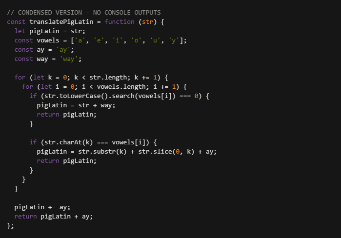

# [freeCodeCamp](https://github.com/Squibs/freeCodeCamp#freecodecamp)

## [Front End Development Projects](https://github.com/Squibs/freeCodeCamp/tree/master/Front%20End%20Development%20Certification#intermediate-algorithms) (Go Back)



### Intermediate Algorithms

<em>Completed July 3, 2017</em>

This was a series of challenges much like the <em>Basic Algorithm Challenges</em> only these challenges pushed what I could do even further. I learned a lot doing these challenges, and I now feel a lot more comfortable with using the JavaScript array and string methods, as well as regular expressions. I do still need to use a reference for these, as there are a lot of methods and it would take a while yet for me to recall them all from only memory, but I now feel that I am able to work with them in ways they are meant to be used.


---

#### My notes for these algorithms:

<b>Intermediate Algorithms</b>

1. [General Notes](#general-notes)
2. [Sum All Numbers in a Range](#sum-all-numbers-in-a-range)
3. [Diff Two Arrays](#diff-two-arrays)
4. [Roman Numeral Converter](#roman-numeral-converter)
5. [Wherefore art thou](#wherefore-art-thou)
6. [Search and Repalce](#search-and-replace)
7. [Pig Latin](#pig-latin)
8. [DNA Pairing](#dna-pairing)
9. [Missing Letters](#missing-letters)
10. [Boo who](#boo-who)
11. [Sorted Union](#sorted-union)
12. [Convert HTML Entities](#convert-html-entities)
13. [Spinal Tap Case](#spinal-tap-case)
14. [Sum All Odd Fibonacci Numbers](#sum-all-odd-fibonacci-numbers)
15. [Sum All Primes](#sum-all-primes)
16. [Smallest Common Multiple](#smallest-common-multiple)
17. [Finders Keepers](#finders-keepers)
18. [Drop It](#drop-it)
19. [Steamroller](#steamroller)
20. [Binary Agents](#binary-agents)
21. [Everytyhing Be True](#everytyhing-be-true)
22. [Arguments Optional](#arguments-optional)


##### General Notes
I created the solutions to these algorithms in ways that I thought up of at the time. Some of them I revised shortly after creating them, to reduce the number of lines needed to output the correct values. I do not believe any of the solutions I came up with are completely optimal, as I am still learning, but I do believe I have come up with alternative solutions for these challenges.

---

##### Sum All Numbers in a Range
```JavaScript
// CONDENSED VERSION - NO NOTES OR CONSOLE OUTPUTS
const sumAll = function (arr) {
  const start = Math.min(arr[0], arr[1]);
  const end = Math.max(arr[0], arr[1]);
  const newArr = [];

  for (let i = start; i <= end; i += 1) {
      newArr.push(i);
  }

  const sum = newArr.reduce((acc, cur) => acc + cur, 0);

return sum;
};
```

(sum-numbers-range.js)

I believe the point of this algorithm was to help understand the use of the `reduce()` method. However I do not believe I have a full understanding of this method after coming up with my solution using this method. There are several other ways to go about solving this algorithm. One method which would have solved this even easier, which I probably should have remembered better from high school, is using summation (((max + min)(max - min + 1))/2).

---

##### Diff Two Arrays
```JavaScript
// CONDENSED VERSION - NO NOTES OR CONSOLE OUTPUTS
const diffArray = function (arr1, arr2) {
  const newArr = arr1.concat(arr2).filter(cur => !arr1.includes(cur) || !arr2.includes(cur));
  return newArr;
};
```

(diff-two-arrays.js)

This one was challenging for me. The last algorithm had me thinking I should use the `reduce()` method for the solution of this. I got to the point where I could filter out the duplicates, but I was missing a way to remove both numbers if they were duplicates. In the end I ended up having to seek additional answers outside of the method documentation. That's where I learned about the includes method.

---

##### Roman Numeral Converter
```JavaScript
// CONDENSED VERSION - NO NOTES OR CONSOLE OUTPUTS
const convertToRoman = function (num) {
  let number = [];

  const romanNumeralsOne = ['I', 'II', 'III', 'IV', 'V', 'VI', 'VII', 'VIII', 'IX'];
  const romanNumeralsTen = ['X', 'XX', 'XXX', 'XL', 'L', 'LX', 'LXX', 'LXXX', 'XC'];
  const romanNumeralsHundred = ['C', 'CC', 'CCC', 'CD', 'D', 'DC', 'DCC', 'DCCC', 'CM'];
  const romanNumeralsThousand = ['M', 'MM', 'MMM'];

  for (let i = 0; i < num.toString().length; i += 1) {
    number.push(num.toString().charAt(i));
  }

  if (number.length > 3) {
    number[0] = romanNumeralsThousand[(number[0] - 1)];
    number[1] = romanNumeralsHundred[(number[1] - 1)];
    number[2] = romanNumeralsTen[(number[2] - 1)];
    number[3] = romanNumeralsOne[(number[3] - 1)];
    console.log(number);
  } else if (number.length > 2) {
    number[0] = romanNumeralsHundred[(number[0] - 1)];
    number[1] = romanNumeralsTen[(number[1] - 1)];
    number[2] = romanNumeralsOne[(number[2] - 1)];
    console.log(number);
  } else if (number.length > 1) {
    number[0] = romanNumeralsTen[(number[0] - 1)];
    number[1] = romanNumeralsOne[(number[1] - 1)];
    console.log(number);
  } else {
    number[0] = romanNumeralsOne[(number[0] - 1)];
    console.log(number);
  }

  number = number.filter(val => val !== undefined).join('');

  return number;
}
```

(roman-num-converter.js)

While I did come up with a solution for this algorithm, I believe I took the most unoptimal route in doing so. Taking a look at freeCodeCamp's basic code solution for this algorithm, I definitely could have done better. The more optimal way would to have just gone off of an array that goes off of values that are one behind introducing the next numeral letter (IX, XL); and decimalValues for these numerals.

---

##### Wherefore art thou
```JavaScript
// CONDENSED VERSION - NO CONSOLE OUTPUTS
const whatIsInAName = function (collection, source) {
  const keys = Object.keys(source);

  let arr = collection.filter((curObject) => {
    for (let i = 0; i < Object.keys(source).length; i += 1) {
      if (!Object.prototype.hasOwnProperty.call(curObject, keys[i]) || curObject[keys[i]] !== source[keys[i]]) {
        return false;
      }
    }
    return true;
  });

  return arr;
};
```

(wherefore-art-thou.js)

This one again took me a while to get to a point where I was understanding how I should go about finding a solution. At the start I was looping through collection and source, while source was converted to an array of keys, with two for loops. Then I was comparing the keys in the currently selected object in collection with those of in source; however I could not find a way to do this for the sources that had multiple keys/values. I had peek at the answer to find a better solution than what I was trying to create. Using the `filter()` method was the correct choice for this algorithm, much like it was for the previous two algorithms. Using a for loop with the `filter()` method allows for the correct arguments for the if statement to be made and allow the correct object properties to be filtered out.

---

##### Search and Replace
```JavaScript
// CONDENSED VERSION - NO CONSOLE OUTPUTS
const myReplace = function (str, before, after) {
  let string = str.split(' ');

  string = string.map((cur) => {
    if (cur.toLowerCase() === before.toLowerCase()) {
      if (before.charAt(0) === before.charAt(0).toUpperCase()) {
        return after.charAt(0).toUpperCase() + after.slice(1);
      }
      return after.charAt(0).toLowerCase() + after.slice(1);
    }
    return cur;
  });

  string = string.join(' ');

  return string;
};
```

(search-and-replace.js)

For this algorithm, since the previous algorithms were mainly working with arrays, I figured I should do the same here. I converted the passed string to an array and used the map method to iterate through the created array replacing the current value with the passed after variable if it was equal to the before value. The replaced value was checked for capitalization before replacing so the value replacing the before value would keep the same casing.

Checking the provided solutions for this algorithm, I could have done this a bit simpler by using the string methods `indexOf()` and `replace()` rather than coverting everything to an array and using array methods.

---

##### Pig Latin
```JavaScript
// CONDENSED VERSION - NO CONSOLE OUTPUTS
const translatePigLatin = function (str) {
  let pigLatin = str;
  const vowels = ['a', 'e', 'i', 'o', 'u', 'y'];
  const ay = 'ay';
  const way = 'way';

  for (let k = 0; k < str.length; k += 1) {
    for (let i = 0; i < vowels.length; i += 1) {
      if (str.toLowerCase().search(vowels[i]) === 0) {
        pigLatin = str + way;
        return pigLatin;
      }

      if (str.charAt(k) === vowels[i]) {
        pigLatin = str.substr(k) + str.slice(0, k) + ay;
        return pigLatin;
      }
    }
  }

  pigLatin += ay;
  return pigLatin + ay;
};
```

(pig-latin.js)

I itterate through the string and a vowels array and compare the two. If the first letter is a vowel just add way to the end of the string. If the word contains a vowel somewhere else slice up to the vowel and put it to the end of the string then add ay to the end of that. If there is no vowel in the word, just ad ay to the end of the word.

After looking at the provided solutions for this, I'm learning that I take the long way around for most things right now. There are better solutions for itterating through strings and arrays and accomplishing what I'm doing in a more simplified / less lines of code way. I could use regex instead of an array to store the vowels and use the `match()` method to search for those letters in the string.

---

##### DNA Pairing
```JavaScript
// CONDENSED VERSION - NO CONSOLE OUTPUTS
const pairElement = function (str) {
  const pairs = { T: ['T', 'A'], A: ['A', 'T'], C: ['C', 'G'], G: ['G', 'C'] };

  const result = str.split('').map(curObj => pairs[curObj]);

  return result;
};
```

(dna-pairing.js)

I started off by putting each pair (AT TA CG GC) as an array in an array [[A,T],[T,A],[C,G],[G,C]]. Since I have been working with APIs in the previous intermediate front end development projects, I decided to turn the array of arrays into a format I'm now familiar with JSON / object. I then split the passed string into an array and used the `map()` method to itterate through the created array. I used the currently selected object/value of the `map()` method to return the correct DNA pair using the previously created object.

---

##### Missing Letters
```JavaScript
// CONDENSED VERSION - NO CONSOLE OUTPUTS
const fearNotLetter = function (str) {
  const string = str.split('').map(curObj => curObj.charCodeAt(0));
  let count = str.charCodeAt(0);

  string.filter((curObj) => {
    if (curObj === count) {
      count += 1;
      return true;
    }
    return false;
  });

  if (count === str.charCodeAt(str.length - 1) + 1) {
    return undefined;
  }

  return String.fromCharCode(count);
};
```

(missing-letters.js)

I believe this might be one of the worst solutions I have come up with yet. After looking at the solutions and comparing to mine, I feel as if I'm going about everything incorrectly. I'm definitely using use the `filter()` method wrong in this case. I should have used the map function to iterrate through instead of using filter to iterate through the created array from using split on the passed string.

<strong>Note from later:</strong>
After looking back at this again compared to the intermediate code solution for this algorithm, I was on the right track with `const string = str.split('').map(curObj => curObj.charCodeAt(0));`

This is the provided intermediate code solution:

```JavaScript
function fearNotLetter(str) {
  var compare = str.charCodeAt(0), missing;

  str.split('').map(function(letter,index) {
    if (str.charCodeAt(index) == compare) {
      ++compare;
    } else {
      missing = String.fromCharCode(compare);
    }
  });

  return missing;
}
```

If I would have used the index along with the currently selected object in the `map()` method (or `letter` in the above solution), I think I could have gotten a solution very similar to this. Instead I decided to iterate again through the array using filter, instead of just using the `map()` method I already used.

---

##### Boo who
```JavaScript
// CONDENSED VERSION - NO CONSOLE OUTPUTS
const booWho = function (bool) {
if (bool === true || bool === false) {
  return true;
}
return false;
};
```

(boo-who.js)

I found this one to be quite easy; but of course looking at the provided solutions, I could have made this much simpler. The better solutions would have been: 

```JavaScript
return typeof bool === 'boolean';
```

If I want to find out if a variable matches a specific type of variable I can use the `typeof` operator. Then I can use something similar for any type of variable.

Type | Result
--- | ---
`Undefined` | "undefined"
`Null` | "object" (see below)
`Boolean` | "boolean"
`Number` | "number"
`String` | "string"
`Symbol` (New in ECMAScript 2015) | "symbol"
`Host object` (provided by the JS environment) | <em>Implementation-dependent</em>
`Function object` (implements [[Call]] in ECMA-262 terms) | "function"
Any other object | "object"

---

##### Sorted Union

```JavaScript
// CONDENSED VERSION - NO CONSOLE OUTPUTS
const uniteUnique = function (arr) {
  const reduced = Array.from(arguments).reduce(
    (prev, curr) => prev.concat(curr));

  const sorted = [];
  reduced.forEach((element) => {
    if (!sorted.includes(element)) {
      sorted.push(element);
    }
  });

  return sorted;
};
```

(sorted-union.js)

For this solution I retrieved the multiple arguments with `Array.from(arguments)`. In the future I would accomplish the same using rest parameters which were introduced in ES2015(ES6). Rest parameters would allow for a indefinite number of arguments, as an array, in a similar fashion to the above.

After retrieving the arguments I flattened the array a bit using reduce and concating the current value, from reduce, to the previous value. After the array is flattened to the appropriate level; I iterated through the flattened array with the `forEach()` method and pushed unique values to a new variable.

---

##### Convert HTML Entities

```JavaScript
// CONDENSED VERSION - NO CONSOLE OUTPUTS
const convertHTML = function (str) {
  const lookup = {34: '&quot;', 38: '&amp;', 39: '&apos;', 60: '&lt;', 62: '&gt;',};
  return str.replace(/[&<>"']/gi, match => lookup[match.charCodeAt(0)]);
};
```

(convert-html-entities.js)

This is the first solution where I feel as though I accomplished everything in a manner that is appropriate out of all the previous intermediate algorithm challenges. I first set up an object relating the character codes to the html entities of which would be needed later to convert symbols in strings. I then used the `replace()` method with a regex expression to which would find matches that I would then convert to character codes to lookup in the previously created object and replace the symbol with the html entity.

Looking at the solutions for this particular algorithm / challenge, I feel as though I gave a pretty close solution to the 'advanced' solution. The given solution spliting the passed string into an array and using the map function to then use a object with direct symbol lookups rather than charcode lookups. I originally was going to do that, but stopped when I got to the apostrophe (') as I was not sure if doing `'\'': '&apos;'` would cause an issue with the escape character being in there. Switching to the way the solution has the object I would be able to remove one method from my return line `.charCodeAt(0)`

---

##### Spinal Tap Case

```JavaScript
// CONDENSED VERSION - NO CONSOLE OUTPUTS
const spinalCase = function (str) {
  const spinal = str.replace(/[a-z](?=[A-Z])/g, '$& ');
  return spinal.split(/[\s_-]/g).join('-').toLowerCase();
};
```

(spinal-tap-case.js)

This challenge listed regex (regular expressions) as a 'helpful link' so I figured I should complete this challenge using regex. I split this into two parts, because I'm unsure of how to, or even if I can, combine these two parts together. 

I take the passed string and use the `replace()` method to put in spaces between lowercase letters and uppercase letters that are right next to each other. I used a special replacement pattern (`$&`) for the `replace()` method which as far as I can tell you can write a string next to this to have inserted at the matched point / characters. I will have to look into this special replacement pattern as well as others. I put in a space following the pattern to put in the space needed.

Next I take the modified string, which is just added spaces, and split that string into an array with the `split()` method. I split the string at any whitespace, underscore, or hyphen. I then immediately join the string using a hyphen. In writing that, I probably didn't even need to split at each hyphen previously.

Taking a look at the solutions, I definitely could have combined my regular expressions.

```JavaScript
return str.split(/\s|_|(?=[A-Z])/).join('-').toLowerCase()
``` 

This is the provided 'advanced' solution. I was pretty close to achieving this. I believe if I understood regular expressions more I would have been able to come up with exactly this. Leave out the hyphen, and use this version of the `?=` quantifier. Where I use this quantifier `/[a-z](?=[A-Z])/g` I'm selecting a lowercase letter followed immediately by an uppercase letter. I'm assuming the given solution's version is selecting anything that is followed by a capital letter.

---

##### Sum All Odd Fibonacci Numbers

```JavaScript
// CONDENSED VERSION - NO CONSOLE OUTPUTS
const sumFibs = function (num) {
  if (num < 3) { return num; }

  let fib = [0, 1, 1, 2];

  for (let i = 3; fib[i] < num; i += 1) {
    fib.push(fib[i] + fib[i - 1]);
  }

  if (fib[fib.length - 1] > num) { fib.pop(); }

  fib = fib.filter((value) => {
    if (value % 2 === 0) {
      return false;
    }
    return true;
  });

  return fib.reduce((prev, curr) => prev + curr);
};
```

(fibonacci-numbers.js)

I first check the passed number to see if it is less than 3. If it is I just return the number as the sum off odd fibonacci sequence numbers for 2 is 2 (0, 1, 1) and for 1, there is only (0, 1) so this works as a simple solution for low numbers. Alternatively I could just leave this check out completely. I then push the sum of the last index value of the array to the second to last value to the end of the array and continue this while the last value of the array is less than the passed number. I then put in a check to see if the last value is less than the passed number, if it is greater: remove the last value. I then remove any even value by checking (value remainder 2) which will return 0 for even or 1 for odd. Then it's a matter of adding up the values in the index and returning that.

While my solution may not be optimal, I feel as though I solved this challenge in a way that is similar to the provided intermediate code solution.

---

##### Sum All Primes

```JavaScript
// CONDENSED VERSION - NO CONSOLE OUTPUTS
const sumPrimes = function (num) {
  if (num === 1) {
    console.log('Passed number is 1, which is not prime; return 0\n');
    return 0;
  }

  let sieve = [];
  const primes = [];

  for (let i = 2; i <= num; i += 1) {
    sieve.push(i);
  }

  while (sieve.length) {
    primes.push(sieve.shift());
    sieve = sieve.filter(value => value % primes[primes.length - 1] !== 0);
  }

  return primes.reduce((acc, cur) => acc + cur, 0);
};
```

(sum-all-primes.js)

This one was probably the hardest for me yet. I had to look up a lot of help for this. In creating my solution; I found ways to tell if a number was prime, another round-about way to see if a number was prime, however, I could not figure out a reliable way to generate prime numbers without having duplicate numbers appear seamingly randomly. I found out about the <em>Sieve of Eratosthenes</em> and from there had to study how people where using it in javascript to generate prime numbers.

After I generated prime numbers from 2 up to the passed number or lower, I then used the `reduce()` method to add up all the prime numbers, which were stored in an array, and returned that value.

This is one I think I will have to return to in the future to better understand what it is I'm doing here. This is the first challenge out of the basic and intermediate algorithm challenges that I feel a bit lost on.

---

##### Smallest Common Multiple

```JavaScript
// CONDENSED VERSION - NO CONSOLE OUTPUTS
const smallestCommons = function (arr) {
  const multiples = function (total, max, min) {
    for (let i = min; i <= max; i += 1) {
      if (total % i !== 0) { return false; }
    }
    return true;
  };

  const maximum = Math.max(arr[0], arr[1]);
  let total = maximum;

  while (!multiples(total, maximum, Math.min(arr[0], arr[1]))) {
    total += maximum;
  }

  return total;
};
```

(smallest-multiple.js)

This one was hard as well for me. I started out by putting the range of each passed argument into a new array and trying to work from that. Once I couldn't figure that out I moved onto finding new solutions. I created another method that loops through each number between the passed argument and tests whether or not the remainder of the total divided by the current number is not equal to 0. It returns false until they all match. The control for this method is in a while loop that addes the maximum to the total each time it returns false. This eventually leads to having the lowest common multiple in the range of numbers.

---

##### Finders Keepers

```JavaScript
// CONDENSED VERSION - NO CONSOLE OUTPUTS
const findElement = function (arr, func) {
  for (let i = 0; i < arr.length; i += 1) {
    if (func(arr[i])) {
      return arr[i];
    }
  }
  return undefined;
};
```

(finders-keepers.js)

Since this one was so short I decided to take another go at it, and make it even shorter. I knew there Had to be some type of method that could handle this without a for loop. So I took a good look at the available array methods and came up with:

```JavaScript
const findElement = function (arr, func) {
  return arr.find(value => func(value));
};
```

(finders-keepers-revised.js)

I take the passed array and use the `find()` method to find the value which meets the criteria of the passed function and return the first value that does.

Taking a look at the answers, I believe I found a much simpler method than the provided answers. Upon looking at the comments for further answers, someone listed this as their answer:

```JavaScript
return arr.find(func);
```

This takes what I came up with and makes it even shorter. Just when I thought I came up with as optimal solution as I could, it just goes to show that there is always another, better way to accomplish the same thing; especially as I am still learning. As far as I can tell since the `find()` method has a description similar to this: "<em>Returns the value of the first element in an array that pass a test</em>"; it is possible to just skip defining the `value` predicate and stating to return a value running through another function... and just put the function there. The function going into the `find()` method as an example for this challenge would be something like: `findElement([..., function(num) { return num % 2 === 0; });` or rewritten as: `findElement(..., num => num % 2 === 0);`. The function already is declaring that it will accept a num variable and return true or false depending on the equation; so I guess the `find()` method will just automatically pass each value in order in the array to this function and then return the first value that passes that functions test.

And looking at the definition / usage of the method:

```
The find() method executes the function once for each element present in the array:

If it finds an array element where the function returns a true value, find() returns the value of that array element (and does not check the remaining values)
Otherwise it returns undefined

Note: find() does not execute the function for array elements without values.

Note: find() does not change the original array.
```

It would appear it works like I thought, stopping on the first true value returned; however it will run the function for each value if the function is not returning boolean values (probably only if it returns true?).

---

##### Drop It

```JavaScript
// CONDENSED VERSION - NO CONSOLE OUTPUTS
const dropElements = function (arr, func) {
  const stop = arr.findIndex(func);
  if (stop === -1) { return []; }
  return arr.slice(stop, arr.length);
};
```

(drop-it.js)

After finishing my solution and looking at the provided answers I realized I could have made this solution one line as well. The provided solution:

```JavaScript
function dropElements(arr, func) {
  return arr.slice(arr.findIndex(func) >= 0 ? arr.findIndex(func): arr.length, arr.length);
}
```
This is exactly what I was trying to accomplish at the start of the algorithm challenge, but could not figure out what I was doing wrong. I was trying something like:

```JavaScript
return arr.slice(arr.findIndex(func) >= 0 ? arr.findIndex(func) : []]);
```
Which I now realize exactly why this was not working. The conditional statement within the `slice()` method is stating what the method should slice out and not return from the entire `dropElements()` method. I'm not sure why I was thinking that way, it was just a simple mistake. I feel as though I was so very close to getting this exact answer, and if I would have just sat there and thought about it for a minute I probably would have gotten it.

---

##### Steamroller

```JavaScript
// CONDENSED VERSION - NO CONSOLE OUTPUTS
const steamrollArray = function (arr) {
  const flattenArray = function (array) {
    return array.reduce((prev, cur) =>
    prev.concat(Array.isArray(cur) ? flattenArray(cur) : cur), []);
  };

  return flattenArray(arr);
};
```

(steamroller.js)

I already stumbled across how to do this when doing the <em>Sorted Union</em> algorithm challenge. I simply went back to that challenge and modified what I already had used.
Previously I used: `.reduce((prev, curr) => prev.concat(curr));`. This time I needed to run this multiple times to flatten the array completely, so I use an argument in the `concat()` method. If the current value is an array flatten the array with the same function that is already flattening the array; otherwise concat the current value to the previous value. Importantly set the `concat()` method to an inital value of an empty array `[]` as well.

---

##### Binary Agents

```JavaScript
// CONDENSED VERSION - NO CONSOLE OUTPUTS
const binaryAgent = function (str) {
  const array = str.split(' ');

  array.forEach((value, index) => {
    const binary = [128, 64, 32, 16, 8, 4, 2, 1];
    let sum = 0;
    for (let i = 0; i < value.length; i += 1) {
      sum += value.charAt(i) * binary[i];
    }
    array[index] = String.fromCharCode(sum);
    return value;
  });

  return array.join('');
};
```

(binary-agents.js)

This is the solution I came up with initially. Then I came up with a revised solution:

```JavaScript
const binaryAgent = function (str) {
  const binary = [128, 64, 32, 16, 8, 4, 2, 1];
  return str.split(' ').map((value) => {
    let sum = 0;
    for (let i = 0; i < value.length; i += 1) {
      sum += value.charAt(i) * binary[i];
    }
    return String.fromCharCode(sum);
  }).join('');
};
```

I create an array for an 8 bit value. I then split the passed string into an array at each space. I then `map()` the array and for each value I use a for loop to get each character and add that value times the current 8-bit/binary position (binary[i]) to a sum. I then return the charcode of the sum and repeat this for each value. I then join the array and return it as a string. I used instructions mainly from [here](https://www.kidscodecs.com/a-binary-numbers-tutorial-with-1-and-0/) as I never knew how to translate binary.

Looking at the provided solutions, particularly the advanced solution:

```JavaScript
function binaryAgent(str) {
  return String.fromCharCode(...str.split(" ").map(function(char){ return parseInt(char, 2); }));
}
```

This is very interesting to see for me. I learned earlier about using `...variable` to retrieve multiple arguments from an array. But this would be put in the functions accepted arguments and wasn't used the other way around like this. I also didn't know you could do this on a single passed argument, a string in this case, I will have to learn more about the `spread syntax`, this seems pretty useful.

---

##### Everytyhing Be True

```JavaScript
// CONDENSED VERSION - NO CONSOLE OUTPUTS
const truthCheck = function (collection, pre) {
  return collection.every(value => !!value[pre]);
};
```

(everything-be-true.js)

It took me a while to figure out once part of this; below is an example of what I was using until I could figure it out:

```JavaScript
  console.log(`Return: ${collection.every((value) => {
    console.log(`Value: ${value[pre]}`);
    console.log(`Truthy?: ${!!value[pre]}`);
    return !!value[pre];
  })}\n`);
```

fI was trying to figure out how to compare a value to `Boolean`. The reason being, in the <em>basic algorithm challenges</em> specificaly <strong>Falsy Bouncer</strong>. From the beginning I knew that particular algorithm would have the answer for this one. I spent a while trying to do something such as `return value[pre] === Boolean` in the above example. It wasn't working, while I thought it would as in <strong>Falsy Bouncer</strong>. I also tried `return typeof (value[pre]) === 'boolean'` as I thought that could work for telling if a value was falsy/truthy or not. In the end I learned about `!!` (not not).

I already knew about `!` (not), which I have used several times before; but then while searching for the opposite of `!` I found `!!`. This allowed me to test just `!!value[pre]` and return `true` or `false` correctly for this challenge. While `!value[pre]` would return the opposite of what I wanted to return.

In the end I came up with my solution above: `return collection.every(value => !!value[pre]);` which correctly returns true or false; and can tell truthy values (the opposite of the <strong>Falsy Bouncer</strong> challenge).


---

##### Arguments Optional

```JavaScript
// CONDENSED VERSION - NO CONSOLE OUTPUTS
const addTogether = function () {
  const args = Array.from(arguments);

  if (typeof args[0] === 'number') {
    if (typeof args[1] === 'number') {
      return args[0] + args[1];
    } else if (!args[1]) {
      return (value) => {
        if (typeof value === 'number') {
          return args[0] + value;
        }
        return undefined;
      };
    }
  }
  return undefined;
};
```

(arguments-optional.js)

I feel like I created a mess of this one. There has to be a way better way to accomplish this. I first create a variable `args` to store the passed arguments, ignoring ESLint errors to not edit the way the function is originally setup (no arguments). I then test if the first argument type is a number or not, then I test if the second argument is a number or not; if it is I add the first argument to the second and return it. If there is not I return the `value` as a closure and if the value is a number add it to the first argument and return that.

I'm still not too sure how closures work. This is something I will have to learn more about.
