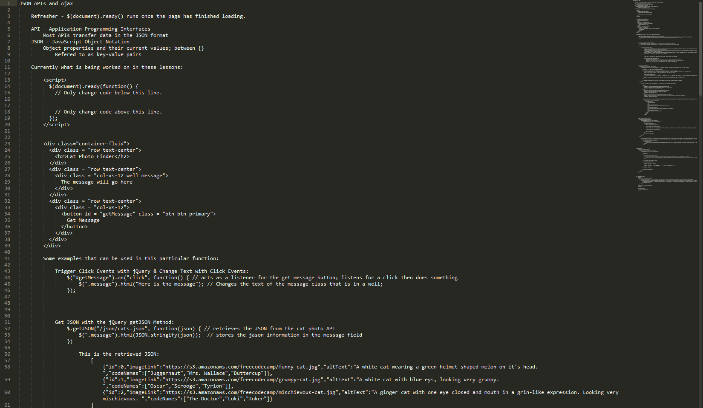

# [freeCodeCamp](https://github.com/Squibs/freeCodeCamp#freecodecamp)

## [Front End Development Projects](https://github.com/Squibs/freeCodeCamp/tree/master/Front%20End%20Development%20Certification#json-apis-and-ajax) (Go Back)



### JSON APIs and Ajax

<em>Completed May 28, 2017</em>

This was a small series of lessons in which taught the very basics of retrieving data from APIs and update HTML using what was retrieved with Ajax. 

While this series was quite short, it did give me some insight on how APIs are used, and I feel as though I could create something with a given API; although probably nothing complicated yet.


---

#### My notes for these lessons:

<b>JSON APIs and Ajax</b>

1. [Refreshers](#refreshers)
2. [Basic Layout for These Lessons](#basic-layout-of-what-is-being-used-throughout-these-lessons-some-bootstrap-classes)
3. [Examples](#some-examples-that-can-be-used-with-this-particular-function)
	1. [Trigger Click Events with jQuery & Change Text with Click Events](#trigger-click-events-with-jquery--change-text-with-click-events)
	2. [Get JSON with the jQuery getJSON Method](#get-json-with-the-jquery-getjson-method)
	3. [Convert JSON Data to HTML](#convert-json-data-to-html)
	4. [Render Images from Data Sources](#render-images-from-data-sources)
	5. [Prefilter JSON](#prefilter-json)
	6. [Get Geolocation Data](#get-geolocation-data)


##### Refreshers:

```javascript
$(document).ready() // runs once the page has finished loading.

```

API - Application Programming Interfaces
- Most APIs transfer data in the JSON format

Json - JavaScript Object Notation
- Object properties and their current values; between { }
	- Refered to as key-value pairs

##### Basic layout of what is being used throughout these lessons (some bootstrap classes):
```HTML
<script>
  $(document).ready(function() {
    // Only change code below this line.

    // Only change code above this line.
  });
</script>

<div class="container-fluid">
  <div class="row text-center">
    <h2>Cat Photo Finder</h2>
  </div>

  <div class="row text-center">
    <div class="col-xs-12 well message">
      The message will go here
    </div>
  </div>

  <div class="row text-cener">
    <div class="col-xs-12">
      <button id="getMessage" class="btn btn-primary">
        Get Message
      </button>
    </div>
  </div>
</div>
```

##### Some examples that can be used with this particular function:

###### Trigger Click Events with jQuery & Change Text with Click Events:
```JavaScript
// acts as a listener for the get message button; listens for a click then does something
$("#getMessage").on("click", function() {

  // Changes the text of the message class that is in a well;
  $(".message").html("Here is the message");

}); 
```


###### Get JSON with the jQuery getJSON Method:
```JavaScript
// retrieves the JSON from the cat photo API
$.getJSON("/json/cats.json", function(json) { 

  // stores the jason information in the message field
  $(".message").html(JSON.stringify(json));  
})
```

This is the retrieved JSON:
```JavaScript
[
  {"id":0,"imageLink":"https://s3.amazonaws.com/freecodecamp/funny-cat.jpg","altText":"A white cat wearing a green helmet shaped melon on it's head. ","codeNames":["Juggernaut","Mrs. Wallace","Buttercup"]},

  {"id":1,"imageLink":"https://s3.amazonaws.com/freecodecamp/grumpy-cat.jpg","altText":"A white cat with blue eys, looking very grumpy. ","codeNames":["Oscar","Scrooge","Tyrion"]},

  {"id":2,"imageLink":"https://s3.amazonaws.com/freecodecamp/mischievous-cat.jpg","altText":"A ginger cat with one eye closed and mouth in a grin-like expression. Looking very mischievous. ","codeNames":["The Doctor","Loki","Joker"]}
]
```

Looks like an array with three objects: each with an id, image, alt-text, and codenames.

Keys and their values make sense to me now. Here's some examples:
- id is a key with a value of 0
- imageLink is a key with a value of "https//s3.amazonaws.com/freecodecamp/funny-cat.jpg"
- altText is a key with a value of "A white cat wearing a green helmet shaped melon on it's head."
- codenames is a key with a value of ["Juggernaut", "Mrs. Wallace", "Buttercup"]


###### Convert JSON Data to HTML:
```JavaScript
$("#getMessage").on("click", function() {

  // get jason, location, function while retrieving, json as passed variable
  $.getJSON("/json/cats.json", function(json) {

    // will store retrieved information
    var html = "";

    // loop through our json adding to the above html variable
    json.forEach(function(val) { 

      // stores the current key based on current val (.forEach acting as loop, val acting as i) 
      var keys = Object.keys(val); 

      // adds the beginning div tag with class of cat
      html += "<div class = 'cat'>"; 

      keys.forEach(function(key) {

        // makes key name strong so it's bold; they adds the key value afterwards; then finally a break for formatting
        html += "<strong>" + key + "</strong>: " + val[key] + "<br>"; 

      });

      // adds the end of the div and a break for formatting for the next div to start
      html += "</div><br>"; 

    });

    // stores all the information from the html variable created in .message
    $(".message").html(html); 

  });
});
```

.message now reads (minus html formatting & not exactly in this particular indentation):
```
id: 0
  imageLink: https://s3.amazonaws.com/freecodecamp/funny-cat.jpg
  altText: A white cat wearing a green helmet shaped melon on it's head. 
  codeNames: Juggernaut,Mrs. Wallace,Buttercup

id: 1
  imageLink: https://s3.amazonaws.com/freecodecamp/grumpy-cat.jpg
  altText: A white cat with blue eys, looking very grumpy. 
  codeNames: Oscar,Scrooge,Tyrion

id: 2
  imageLink: https://s3.amazonaws.com/freecodecamp/mischievous-cat.jpg
  altText: A ginger cat with one eye closed and mouth in a grin-like expression. Looking very mischievous. 
  codeNames: The Doctor,Loki,Joker
```

The HTML would look like this (as an example for only the first cat, each subsequent cat would be in their own div with class of 'cat'):
```HTML
<div class="col-xs-12 well message">
  <div class="cat">
    <strong>id</strong>
    ": 0"
    <br>
    <strong>imageLink</strong>
    ": https://s3.amazonaws.com/freecodecamp/funny-cat.jpg"
    <br>
    <strong>altText</strong>
    ": A white cat wearing a green helmet shaped melon on it's head."
    <br>
    <strong>codeNames</strong>
    ": Juggernaut,mrs.Wallace,Buttercup"
    <br>
  </div>
  <br>
</div>
```


###### Render Images from Data Sources:
```JavaScript
$(document).ready(function() {
  $("#getMessage").on("click"), function() {
    $.getJSON("/json/cats.json", function(json) {
      var html = "";

      json.forEach(function(val) {
        html += "<div class = 'cat'>";

        // Only change code below this line.

        // stores the html to load the images and display them
        html += "";

        // Only change code above this line.

        html += "</div>";
      });

      $(".message").html(html);
    });
  });
});
```

The HTML created with this (in the .message well div; looks like apostrophies are messed up in this example; this is only an example of the first image, the others would be here as well; they also have no formatting to them, so they are the original size... so the code would have to change to possibly correct this, or the css could do it):
```HTML
<div class="col-xs-12 well message">
  <div class="cat">
    
  </div>
</div>
```


###### Prefilter JSON:
```JavaScript
$(document).ready(function() {

  $("#getMessage").on("click", function() {
    $.getJSON("/json/cats.json", function(json) {

      var html = "";

      // Only change code below this line.

        // create a filter for the json.forEach "loop"; so we don't render every image
        json = json.filter(function(val) { 

          // only render images (look at code below; we're only rendering images) that do not have a id of 1 (so two images should render; id:0 and id:2)
          return (val.id !== 1); 
        });

      // Only change code above this line.

      json.forEach(function(val) {

        html += "div class = 'cat'>";

        html += "";

        html += "</div>";
      });

      $(".message").html(html);
    });
  });
});	
```


###### Get Geolocation Data:
```HTML
<script>
// Only change code below this line.
  
  // if available (probably will get prompt from browser) use built in browser navigator to get location
  if (navigator.geolocation) {	

    // get current position and do this function (pass this information as position variable)
    navigator.geolocation.getCurrentPosition(function(position) {

      // select the data id in the html to write the latitude and longitude information in html
      $("#data").html("latitude: " + position.coords.latitude + "<br>longitude: " + position.coords.longitude); 
    });
  }
  
// Only change code above this line.
</script>

<div id = "data">
	<h4>You are here:</h4>
</div>
```
