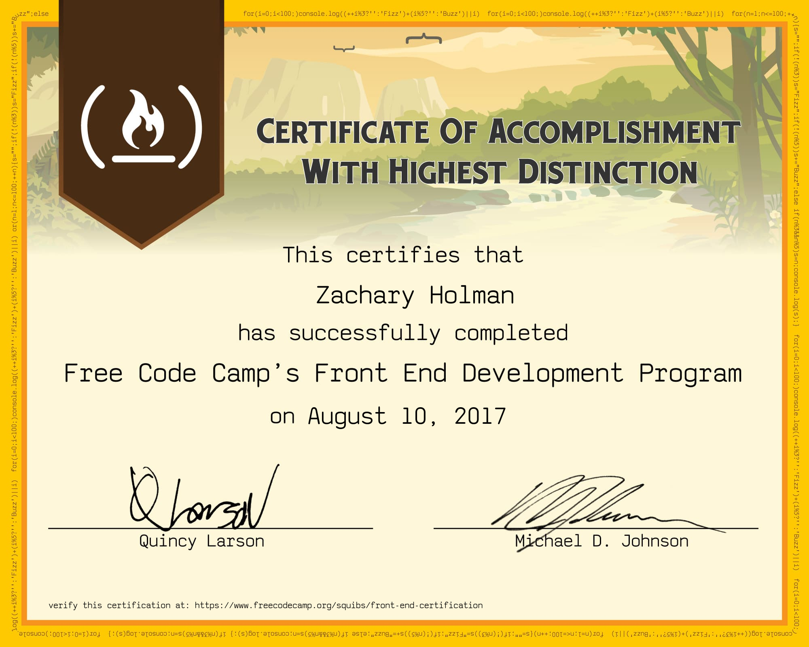

# My Front End Development Certification
A Simon Says game I have created while going through the advanced front end development project challenges at https://freeCodeCamp.com

## [Front End Development Projects](https://github.com/Squibs/freeCodeCamp/tree/master/Front%20End%20Development%20Certification#my-front-end-development-certificaton) (Go Back)
 

### [My Front End Development Certification](https://www.freecodecamp.org/squibs/front-end-certification) (Click to view functional site)

<em>Recieved August 10, 2017</em>

Here it is, my <b>Front End Development Certification</b>. I have been working towards this since I started learning on freeCodeCamp. I began my journey on <em>May 3, 2017</em>; roughly 98 days later I have recieved this certification.

I started out knowing only a small amount of HTML, CSS, and JavaScript. I had only really previous made <a href="http://learningtonecro.com/"><em>Learning to Necro</em></a> a website I created around the time <b>Guild Wars 2</b> came out in <em>August of 2012</em>. I can definitely see a huge improvement from where I first started.

I feel pretty confident in HTML, CSS, and JavaScript having gone this far. I feel like I can work my way through quite a bit. I still have to look things up in order to accomplish things; but no where near as much as I originally did. I have created many things in which I am quite happy about.

As far as aesthetics go my favorite project I have made so far would probably be my <a href="https://squibs.github.io/wikipedia-viewer/">Wikipedia Viewer</a>:

I am just so very pleased with myself in the color choices and just the general modern-ish look I have created with this project.

As far as my overall favorite project I have created, it would probably be my <a href="https://squibs.github.io/" target="_blank">portfolio page</a>:

My portfolio was only the second real project I created, following my Tribute Page to John M. Keynes. This project was with me from the start, and I have been updating it with every new project I have finished. While I feel I have learned enough to greatly improve my portfolio page design a lot, I feel I should wait a while longer before giving it a overhaul.

It's been quite a journey to this point, however I still have a lot to learn. I look forward to continuing on through the freeCodeCamp lessons and projects and continuing to improve my own skills and abilities in web development.

				