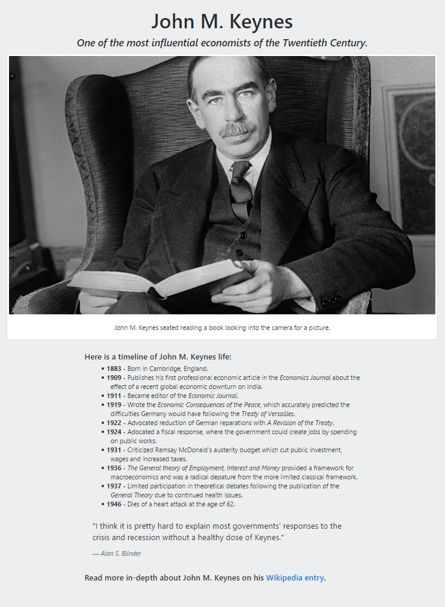

# [freeCodeCamp](https://github.com/Squibs/freeCodeCamp#freecodecamp)

## [Front End Development Projects](https://github.com/Squibs/freeCodeCamp/tree/master/Front%20End%20Development%20Certification#tribute-page) (Go Back)

### [Tribute Page](https://codepen.io/Sulph/full/XRavGG/) (Click to view functional site on code-pen)

<em>Completed May 05, 2017</em>

The first basic front end development project introduced. I made a tribute page to John M. Keynes a 20th century British economist. This was the first project that did not give any step-by-step directions and instead let the learner go off of just an example as a end-goal. I used some Bootstrap 4.0.0 alpha classes in this project; mainly a 'Card' for the image, as they removed thumbnails in this version of Bootstrap.

