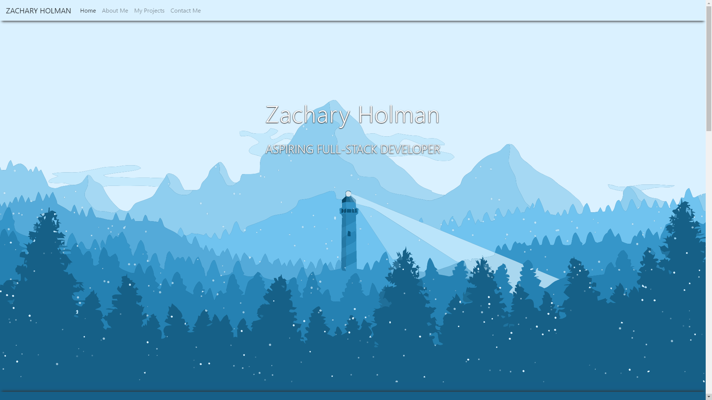
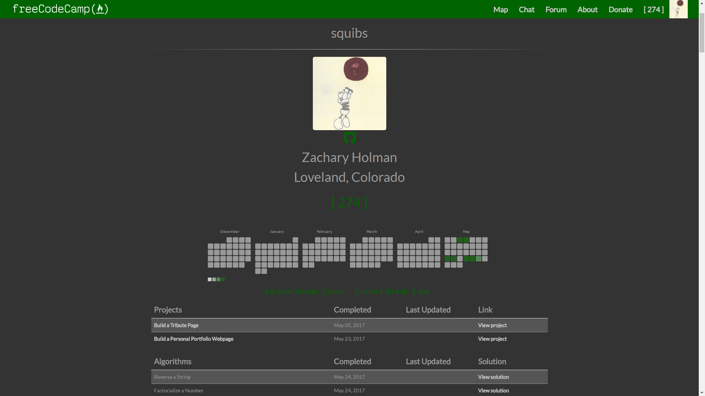
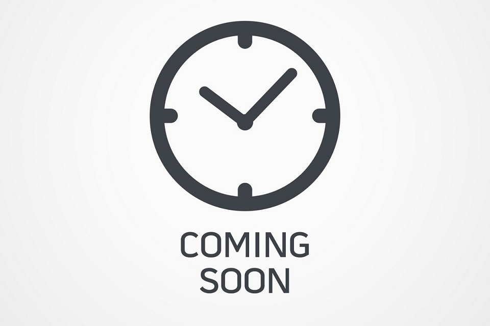

# freeCodeCamp
The solutions I have created while going through the project challenges at https://freeCodeCamp.com. Feel free to click on the images below to take you to their respective areas within this repository; see what I have created and my solutions to many of the freeCodeCamp challenges and projects.

## Navigation

### A few quick links

- [My Portfolio](https://github.com/Squibs/Squibs.github.io) (Created as a challenge within freeCodeCamp)

- [My freeCodeCamp Profile](https://www.freecodecamp.com/squibs)

<b>Click on any of the images/links below to view various projects, view notes, and read about the experiences I have had with each project while going through freeCodeCamp.</b>

---

### [Front End Development Certification](https://github.com/Squibs/freeCodeCamp/tree/master/Front%20End%20Development%20Certification#freecodecamp)

---

### Back End Development Certification

---

### Data Visualization Certification

